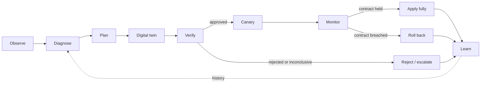
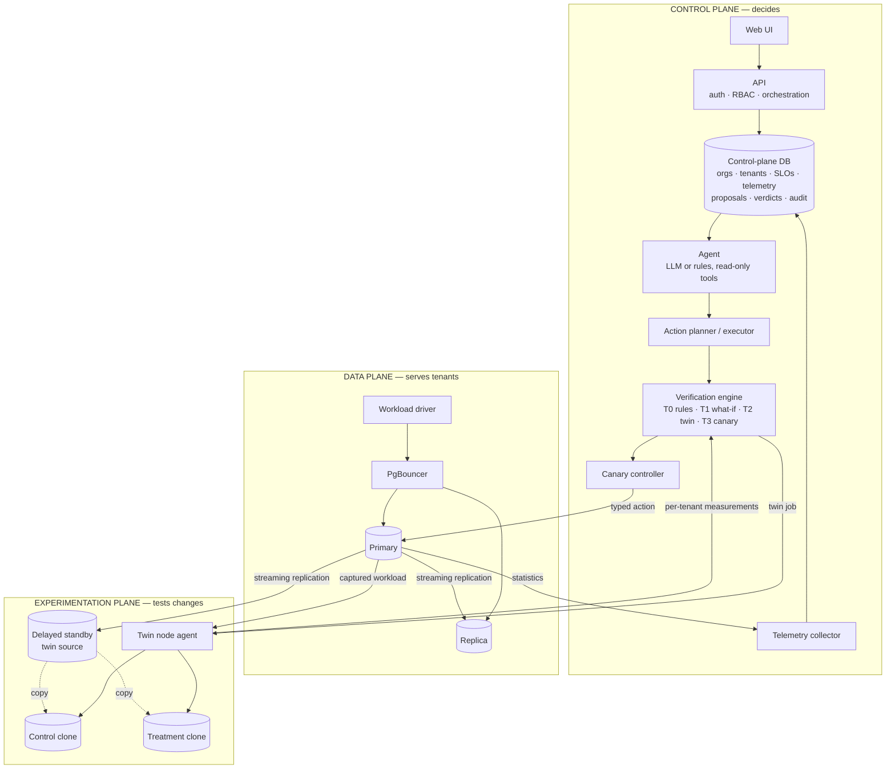
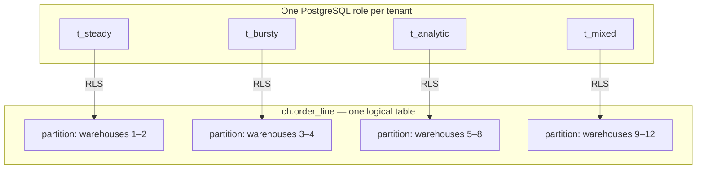
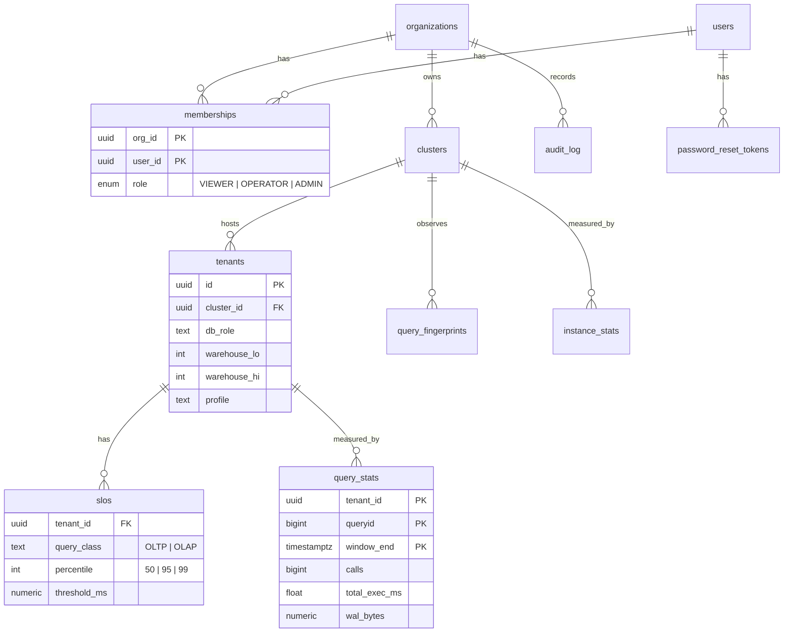
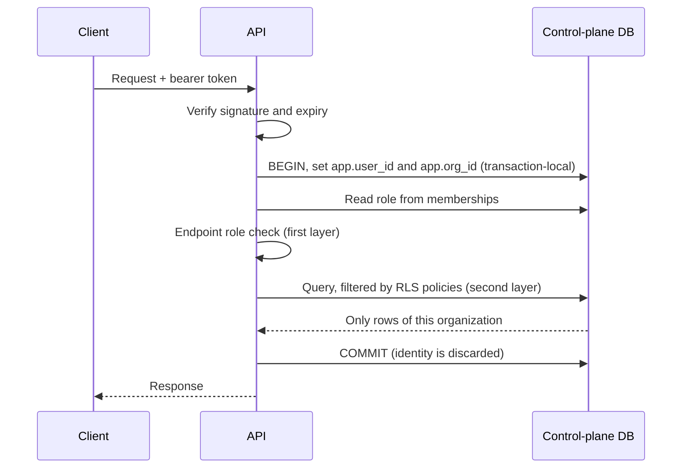
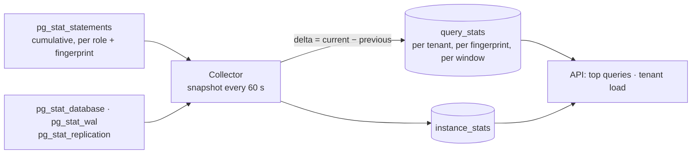
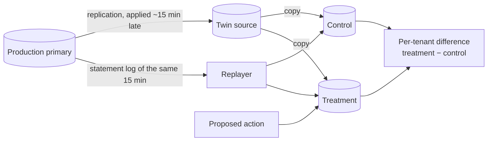

# DBPilot

**Safe, tenant-aware autonomous optimisation for shared PostgreSQL.**

DBPilot is a control plane for a PostgreSQL cluster that many tenants share. An
AI agent watches the cluster and proposes optimisations. DBPilot does not trust
those proposals: it measures each one on a real clone of the database, under a
replay of the real workload, for every tenant, and applies it only when the
tenant it is meant to help benefits **and no other tenant is harmed**.

> **Project state.** The control plane, the multi-tenant data plane, the
> workload driver and the telemetry pipeline are implemented and tested. The
> agent, digital twin, verification engine, canary controller and web UI are
> designed in detail but not yet implemented. The [status table](#20-implementation-status)
> says exactly which is which. No experimental results are claimed yet.

---

## Contents

1. [The problem](#1-the-problem)
2. [The idea](#2-the-idea)
3. [Architecture](#3-architecture)
4. [Multi-tenancy model](#4-multi-tenancy-model)
5. [Control plane](#5-control-plane)
6. [Data plane](#6-data-plane)
7. [Workload driver](#7-workload-driver)
8. [Telemetry](#8-telemetry)
9. [Agent and action space](#9-agent-and-action-space)
10. [Digital twin](#10-digital-twin)
11. [Verification engine](#11-verification-engine)
12. [Canary and rollback](#12-canary-and-rollback)
13. [Learning loop](#13-learning-loop)
14. [Security model](#14-security-model)
15. [Technology stack](#15-technology-stack)
16. [Getting started](#16-getting-started)
17. [API overview](#17-api-overview)
18. [Testing](#18-testing)
19. [Repository layout](#19-repository-layout)
20. [Implementation status](#20-implementation-status)
21. [Research context](#21-research-context)

---

## 1. The problem

Software-as-a-service products usually keep many customers ("tenants") in one
PostgreSQL instance, because one instance per customer is expensive. Sharing
creates a tuning problem that single-database tuning does not have:

| A change that helps one tenant… | …can hurt the others |
|---|---|
| An index that speeds up an analytics tenant's reads | Every write to that table now also maintains the index |
| More memory per sort for heavy reports | Less memory left when many small transactions run at once |
| More parallel workers per query | Fewer CPU cores for latency-sensitive transactions |
| Sending reports to a read replica | Stale results, or cancelled queries when the replica lags |

Language-model agents can now propose such changes convincingly. Published LLM
tuning systems are evaluated on one workload with one aggregate number
(throughput). In a shared instance the aggregate can improve while one tenant
gets worse, and nobody notices until that tenant complains.

DBPilot's question:

> Can an autonomous system safely optimise a shared multi-tenant PostgreSQL
> cluster by verifying each AI-proposed change in a digital twin, per tenant,
> before it reaches production?

## 2. The idea



Four rules hold everywhere:

1. **The agent never executes SQL.** It chooses from a closed set of typed
   actions; a deterministic executor turns an approved action into SQL.
2. **The agent cannot approve its own proposal.** Verification is separate code.
3. **Every affected tenant is measured**, not just the one being helped.
4. **Uncertain is not safe.** A result that cannot be distinguished from harm is
   not approved.

## 3. Architecture

DBPilot is split into three planes so that experimentation can never disturb
what it is measuring.



| Plane | Purpose | Why it is separate |
|---|---|---|
| Control | Stores state, decides, exposes the product | Must stay up and consistent regardless of load elsewhere |
| Data | Runs tenant workload | Is the thing being protected |
| Experimentation | Runs clones under replayed load | Replay is real load; on shared hardware it would distort production measurements |

In development all three run on one machine under Docker Compose, pinned to
disjoint CPU cores. For evaluation and cloud deployment the design places each
plane on its own node, with the experimentation node reserved for twin work.

## 4. Multi-tenancy model

Tenants share one database and the same tables. Three mechanisms keep them
apart and make them individually observable:



- **A role per tenant.** PostgreSQL's `pg_stat_statements` records statistics
  per role, so every query is attributed to a tenant with no proxy or tagging.
  Settings can also be changed for one role only.
- **Row-level security.** Each tenant owns a range of warehouse ids. A policy
  on every table restricts the role to its range. Tenants hold no privileges on
  the partitions themselves, so the policy cannot be bypassed.
- **A partition per tenant.** The six large tables are range-partitioned by
  warehouse id. PostgreSQL prunes other tenants' partitions at query start
  (`EXPLAIN` shows `Subplans Removed: 3`), and an index can be built for one
  tenant alone.

## 5. Control plane

A FastAPI service over its own PostgreSQL database.

### Data model



An **organization** is a DBPilot customer. It owns **clusters** (managed
PostgreSQL deployments), each hosting **tenants** (the customer's own
customers) with **SLOs** (for example "99% of OLTP requests under 100 ms").

### Database concepts in use

| Concept | Where | What it guarantees |
|---|---|---|
| Normalised schema, M:N via `memberships` | `001_foundation.sql` | A user can belong to several organizations with a different role in each |
| Composite foreign keys | `tenants → clusters (id, org_id)` | A tenant cannot reference another organization's cluster |
| Exclusion constraint | `tenants_no_overlapping_ranges` | Two tenants in a cluster can never own overlapping warehouse ranges |
| Generated column | `users.has_password` | The API can tell an invite is pending without being able to read the hash |
| Row-level security | `003_security.sql` | Organization isolation and role checks enforced by PostgreSQL itself |
| `SECURITY DEFINER` functions | `004_auth_functions.sql` | Narrow, single-purpose access to credentials |
| Transactions | `cp.signup` | Organization, first user, membership and audit record commit together or not at all |
| Row locking | `cp.guard_last_admin`, `cp.consume_token` | Two admins demoting each other, or one reset token used twice, cannot both succeed |
| Triggers | `002_audit.sql` | Audit rows are written by the database; the log cannot be updated, deleted or truncated |
| Declarative partitioning | `cp.query_stats` by day | Old telemetry is dropped by partition; recent queries read recent partitions only |
| Keyset pagination on an index | audit API | Constant-time paging however deep |

### Request path



The role is read from the database on every request, not stored in the token,
so demoting or removing a member takes effect immediately.

## 6. Data plane

| Component | Role |
|---|---|
| Primary (PostgreSQL 18) | Serves tenant reads and writes; `pg_stat_statements`, `auto_explain` and HypoPG loaded |
| Replica | Hot standby by streaming replication; target for read routing |
| PgBouncer | Connection pooler in transaction mode; the only way tenants connect |
| Seed job | Provisions four tenants and loads their data |

**Schema.** Derived from CH-benCHmark: the nine TPC-C tables (warehouse,
district, customer, history, orders, new_order, order_line, stock, item) plus
nation, region and supplier. The loader follows the TPC-C population rules: 10
districts per warehouse, 3,000 customers and 3,000 orders per district, 100,000
items, the last 30% of orders undelivered. The development seed loads 12
warehouses across four tenants, about 1.2 GB.

This schema follows the published specifications but is not an audited TPC
implementation. Results obtained with it are "CH-benCHmark-derived", never TPC
results.

**PgBouncer authentication.** Tenant roles are created at runtime, so PgBouncer
looks up each one's SCRAM verifier through a database function that answers
only for tenant roles. The database owner and service roles cannot be reached
through the pooler at all.

## 7. Workload driver

A tenant-aware load generator that connects through PgBouncer as each tenant.

- **Transactions.** The five TPC-C transactions in the specified mix: New-Order
  45%, Payment 43%, Order-Status 4%, Delivery 4%, Stock-Level 4%, with the
  specification's skewed random distributions and the 1% rollback rule.
- **Analytical queries.** Six CH-benCHmark queries (Q1, Q3, Q4, Q6, Q12, Q14)
  and one ad hoc item lookup.
- **Profiles.** Each tenant has streams with an arrival rate and optional
  periodic bursts ([`baseline.json`](workload/profiles/baseline.json)).
- **Open loop.** Arrivals follow a Poisson schedule that does not depend on how
  fast the database answers, and latency is measured from the scheduled arrival
  time. A closed-loop generator slows itself down when the database is slow and
  under-reports the very latencies that matter (coordinated omission).
- **Output.** Per-interval and whole-run p50/p95/p99, throughput, errors and
  dropped arrivals for every tenant and class. This is the client-side ground
  truth used for evaluation, kept separate from what DBPilot itself observes.

## 8. Telemetry



PostgreSQL's counters only grow. The collector snapshots them and stores the
difference between consecutive snapshots, so each row means "this tenant ran
this query this many times, for this long, in this window". A statistics reset
is detected (a counter went down) and handled; a query first seen inside a
window counts from zero.

The collector runs with least privilege on both sides: a monitoring role on the
data plane that can read statistics but no table data, and a control-plane role
that can append telemetry but cannot read users, memberships or the audit log.

The design adds latency percentiles from sampled statement logs, sampled
execution plans, wait and lock sampling, and workload-shift detection.

## 9. Agent and action space

*Designed.* The agent is given read-only tools — top queries, execution plans,
table and index profiles, wait profiles, SLO status, a what-if index check, and
past outcomes — and reasons over real system state. Its only output with any
effect is one typed action:

| ID | Action | Scope | Inverse |
|---|---|---|---|
| A0 | No action / escalate to a human | — | — |
| A1 | Create index | One tenant's partition, or all | Drop |
| A2 | Drop unused index | Same | Recreate from stored definition |
| A3 | Role-level setting (allowlisted, bounded) | One tenant | Previous value |
| A4 | Instance setting (reload-only, allowlisted, bounded) | Instance | Previous value |
| A5 | Refresh or tune statistics | One table | Previous value |
| A6 | Route a tenant's reads to the replica | One tenant | Route back |
| A7 | Per-tenant concurrency cap | One tenant | Previous value |
| A8 | Query rewrite | Advisory only | — |

A rule-based proposer implements the same interface. It is the baseline the
agent is compared against, and it lets the whole pipeline run without a model.

## 10. Digital twin

*Designed.* The twin is a real PostgreSQL instance, not a simulation.



1. A standby deliberately stays about 15 minutes behind production, so it is
   always at a known past state for which the workload has already been captured.
2. It is copied twice. Both copies become standalone instances.
3. The proposed action is applied to the treatment copy only.
4. The captured workload is replayed against both, with original timing and
   tenant roles, interleaved to cancel drift.
5. Latency, throughput, errors, write volume, index size and resource use are
   compared per tenant.

**Fidelity is measured, not assumed.** Runs with no change give the noise
floor; known good and known harmful actions are applied to both the twin and
production to report how often the twin predicts the right direction.

## 11. Verification engine

*Designed.* Four tiers, cheapest first. Each returns approve, reject or
inconclusive.

| Tier | Check | Cost |
|---|---|---|
| T0 | Static rules: valid, within bounds, memory and storage budgets | Milliseconds |
| T1 | Planner what-if with hypothetical indexes | Seconds |
| T2 | Digital twin replay | Minutes |
| T3 | Canary in production | Minutes to hours |

Tier 2 approves only if **all** hold:

- the target tenant's improvement is statistically clear and large enough;
- for **every other tenant**, any regression is statistically shown to be
  within a small margin, and its SLO is still predicted to hold;
- storage growth, write amplification, build cost and replica lag are within budget;
- actions that are expensive to undo meet stricter thresholds.

It also emits a **rollback contract**: per-tenant thresholds, derived from the
twin's prediction, that the canary will enforce.

## 12. Canary and rollback

*Designed.* How a change is exposed gradually depends on what it is:

| Action | First | Then |
|---|---|---|
| Index | Target tenant's partition | Other partitions |
| Role-level setting | A fraction of the tenant's sessions | All sessions |
| Read-path instance setting | Replica | Primary |
| Write-path instance setting | Time-boxed on the primary | Confirmed |
| Routing, concurrency cap | A percentage of traffic | All |

Rollback is automatic when a tenant breaches its contract in two of three
windows, errors or lock waits spike, replica lag exceeds budget, production
deviates from the twin's prediction, telemetry is lost, or the canary is not
confirmed in time.

## 13. Learning loop

*Designed.* Every proposal leaves one record: observations → proposal → tier
verdicts → twin prediction → canary result → production result. Two uses from
the start: calibrating how much to trust the twin for each kind of action, and
giving the agent past outcomes on similar targets. A learned model that
predicts rejection is a later addition, once there is enough history to train on.

## 14. Security model

| Concern | Mechanism |
|---|---|
| Passwords | Argon2id hashes; the API's database role has no privilege to read them |
| Sessions | Signed, expiring tokens carrying only user and organization ids |
| Authorization | Role checked in the API and again by row-level security |
| Organization isolation | Row-level security; without a request context the API role sees zero rows |
| Reset and invite links | Random, single-use, expiring; only a SHA-256 hash is stored |
| Account probing | Login and password-reset responses are identical for known and unknown emails |
| Audit | Trigger-written, append-only, immutable even for the database owner |
| Tenant isolation | One role per tenant, row-level security, no privileges on partitions |
| Pooler | Admits tenant roles only |
| Service roles | Separate least-privilege roles for the API, the collector and monitoring |
| Secrets | Environment variables from an untracked `.env`; nothing hard-coded |

## 15. Technology stack

| Technology | Used for | Why this one |
|---|---|---|
| PostgreSQL 18 | Managed database and control-plane store | Row-level security, partitioning, rich statistics views, JSON plans |
| `pg_stat_statements` | Per-tenant query statistics | Built in; keyed by role |
| HypoPG | Planner what-if | Tests an index without building it |
| PgBouncer | Pooling, tenant-only login, routing | The control point for per-tenant limits |
| FastAPI + psycopg 3 | Control-plane API | Async, typed, SQL written by hand so the database features are visible |
| Docker Compose | Running the system | One command reproduces every service and version |
| pytest | Tests | Run inside the containers against real databases |

Planned with the remaining components: React with TypeScript for the UI,
language-model tool calling for the agent, scipy for the verification
statistics, Prometheus for host metrics, and k3s for the three-node deployment.
Deliberately not used: vector databases, agent frameworks, message queues.

## 16. Getting started

Requirements: Docker with Compose, about 8 GB of free memory.

```bash
cp .env.example .env            # then replace every value
docker compose up -d --build    # control plane, data plane, collector
docker compose run --rm dp-seed     # load four tenants (about 5 minutes)
docker compose run --rm demo-seed   # register them as a demo organization
```

Generate load and watch it arrive:

```bash
docker compose run --rm workload --duration 180
```

After two collector windows (about two minutes), open http://localhost:8000/docs,
log in with `DEMO_ADMIN_EMAIL` / `DEMO_ADMIN_PASSWORD` from `.env`, and call
`/clusters/{id}/top-queries`.

| Service | Address |
|---|---|
| API and interactive documentation | http://localhost:8000/docs |
| PgBouncer (tenants) | localhost:6432 |
| Primary / replica (administration) | localhost:5441 / localhost:5442 |
| Control-plane database | localhost:5440 |

## 17. API overview

All paths are under `/api/v1`.

| Area | Endpoints | Minimum role |
|---|---|---|
| Authentication | `POST /auth/signup`, `/auth/login`, `/auth/forgot-password`, `/auth/reset-password`, `/auth/switch-org`; `GET /auth/me` | — |
| Members | `GET /members` | VIEWER |
| | `POST /members`, `PATCH /members/{id}`, `DELETE /members/{id}` | ADMIN |
| Clusters | `GET /clusters` | VIEWER |
| | `POST /clusters` | ADMIN |
| Tenants and SLOs | `GET /tenants`, `GET /tenants/{id}/slos` | VIEWER |
| | `POST /tenants`, `DELETE /tenants/{id}`, `PUT /tenants/{id}/slos` | OPERATOR |
| Telemetry | `GET /clusters/{id}/top-queries`, `/tenant-load`, `/instance` | VIEWER |
| Audit | `GET /audit` | VIEWER |

## 18. Testing

Tests run inside containers against real PostgreSQL instances.

```bash
docker compose run --rm --no-deps api python -m pytest -q                       # control plane
docker compose run --rm dp-test                                                 # data plane
docker compose run --rm --entrypoint python workload -m pytest -q tests         # workload driver
```

| Suite | Tests | Examples of what is proven |
|---|---|---|
| Control plane | 51 | A VIEWER cannot write even with raw SQL; organizations cannot see each other; two admins demoting each other concurrently leaves exactly one; the audit log cannot be altered; telemetry is attributed to the right tenant |
| Data plane | 18 | A tenant sees only its warehouses and cannot reach another tenant's partition; partitions are pruned under row-level security; an index can be built for one tenant; the replica follows and is read-only; the pooler refuses non-tenant roles |
| Workload driver | 19 | Each transaction and query runs correctly as a tenant; New-Order keeps orders and order lines consistent; the open-loop generator hits its target rate |

## 19. Repository layout

```
controlplane/
  app/            API: auth, members, resources, telemetry, audit; collector
  migrations/     control-plane schema, security, functions, telemetry
  tests/
dataplane/
  postgres/       image, schema, tenancy, loader, replica bootstrap
  pgbouncer/      image and configuration
  seed/           four-tenant development seed
  tests/
workload/
  workload/       TPC-C transactions, analytical queries, open-loop driver
  profiles/       tenant arrival profiles
  tests/
docs/
  ARCHITECTURE.md     the full design specification
  LEARNING_GUIDE.md   every technology explained
docker-compose.yml
```

## 20. Implementation status

| Component | State |
|---|---|
| Authentication, organizations, RBAC, audit | Implemented, tested |
| Clusters, tenants, SLOs | Implemented, tested |
| Multi-tenant data plane, replica, pooler | Implemented, tested |
| Workload driver | Implemented, tested |
| Telemetry: per-tenant query and instance statistics | Implemented, tested |
| Telemetry: percentiles from logs, plans, waits, shift detection | Designed |
| Scenario suite and baselines | Designed |
| Digital twin and replay | Designed |
| Agent, action planner, executor | Designed |
| Verification engine, canary controller, outcome ledger | Designed |
| Web UI | Designed |
| Three-node Kubernetes deployment | Designed |
| Experimental evaluation | Not started; no results exist |

An earlier prototype of this project is preserved at the git tag `v1-archive`.
Its results are not evidence for this system.

## 21. Research context

DBPilot builds on existing ideas and does not claim to have invented them:

- **Testing a change on a clone and reverting on regression** is established
  practice: Azure SQL Database tunes indexes on cloned "B-instances" with
  replayed workload (SIGMOD 2019), and Oracle verifies invisible indexes before
  exposing them (VLDB 2025).
- **LLM-based database tuning** is an active field: GPTuner, λ-Tune, AgentTune,
  and others, evaluated mainly on single workloads with aggregate metrics.
- **SLO-aware multi-tenant tuning** was studied before LLMs (Tempo, VLDB 2016).

What DBPilot sets out to add is the combination, and its measurement: gating
agent proposals on **per-tenant non-inferiority** in a shared instance, and
quantifying what a twin adds over a canary alone, on a scenario suite that
includes deliberate traps where the tempting change harms a neighbour. Whether
that is a new contribution needs a systematic literature review, which has not
yet been done.

Further reading: [architecture specification](docs/ARCHITECTURE.md) ·
[learning guide](docs/LEARNING_GUIDE.md)

## License

See [LICENSE](LICENSE).
