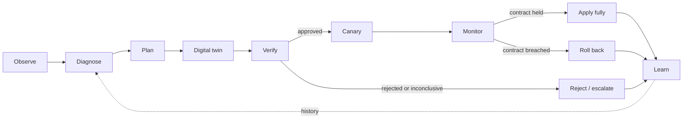
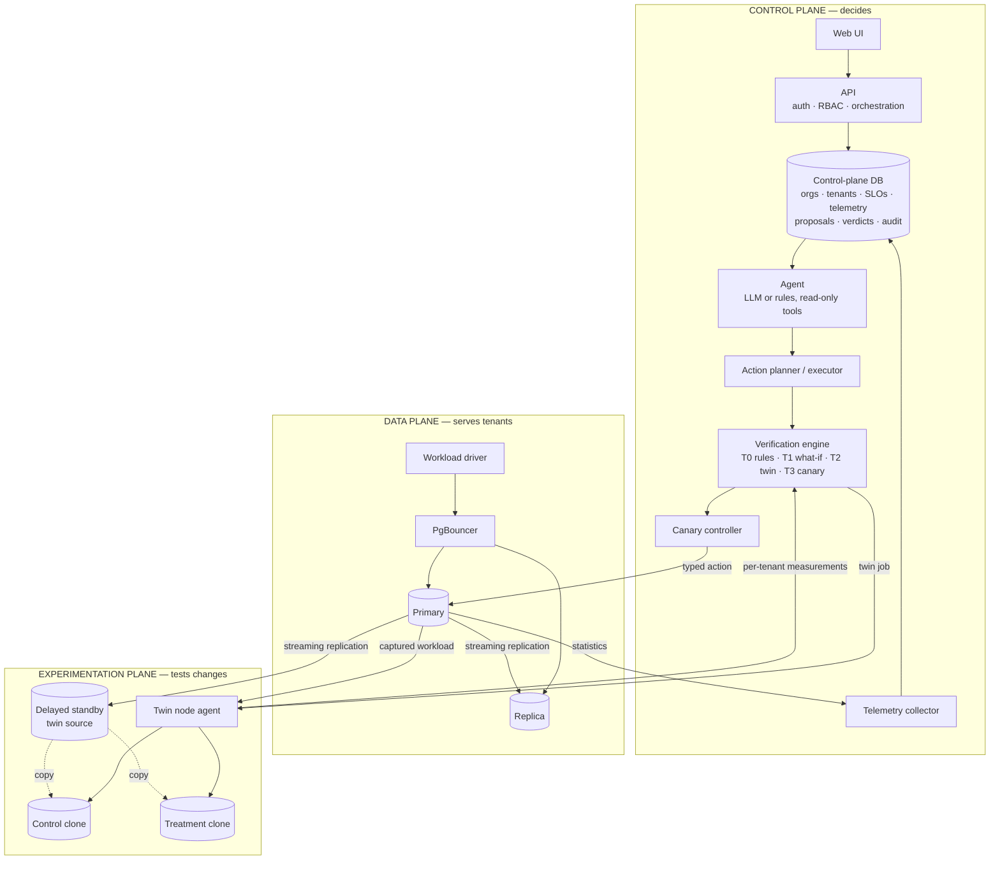
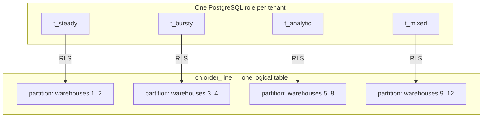
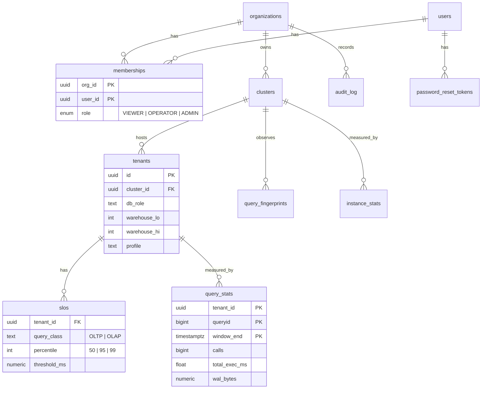
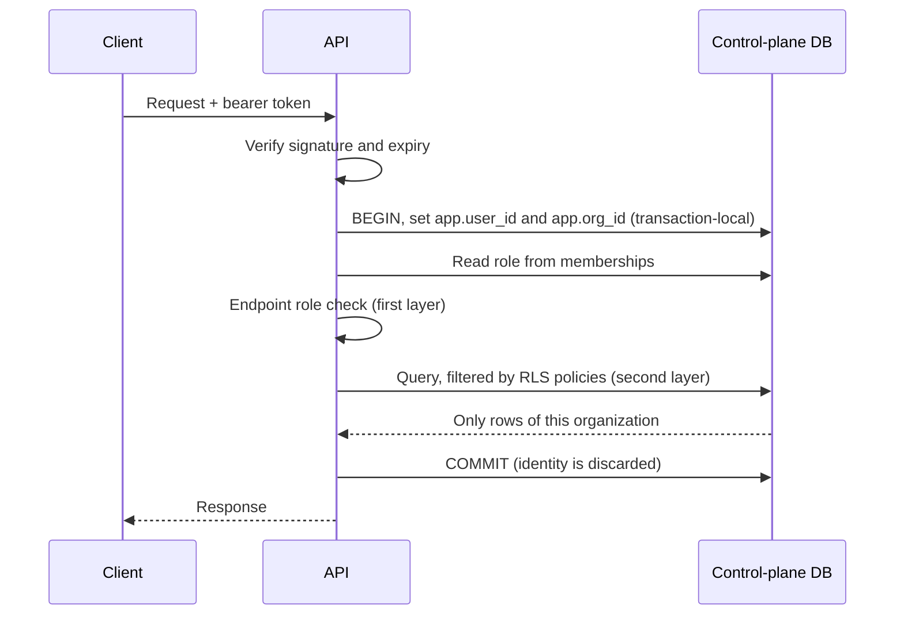
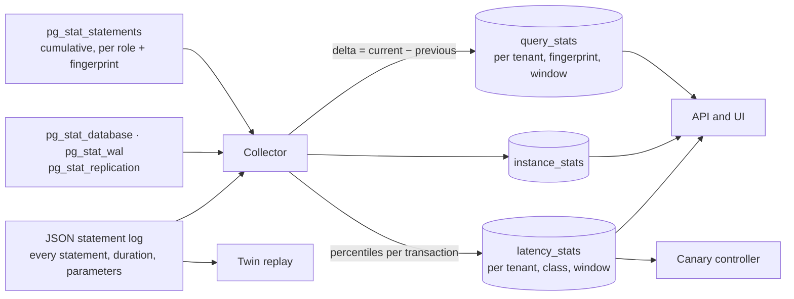
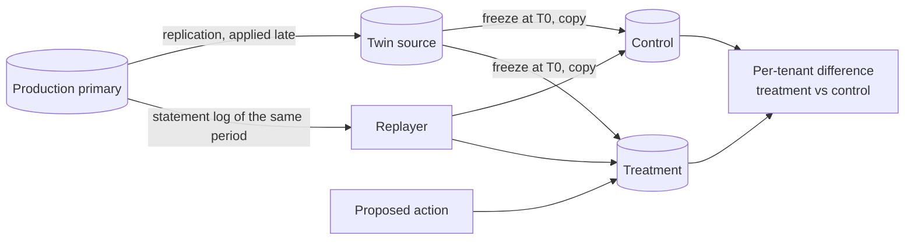
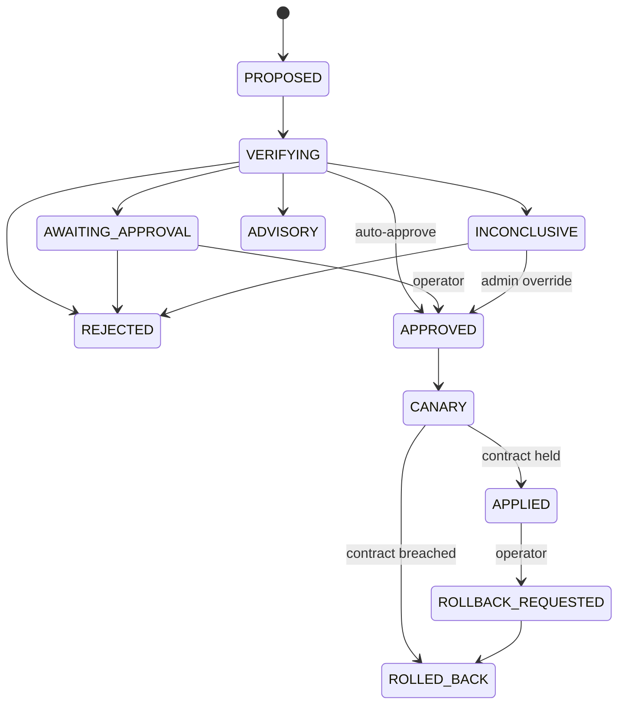

# DBPilot

**Safe, tenant-aware autonomous optimisation for shared PostgreSQL.**

DBPilot is a control plane for a PostgreSQL cluster that many tenants share. An
AI agent watches the cluster and proposes optimisations. DBPilot does not trust
those proposals: it measures each one on a real clone of the database, under a
replay of the real workload, for every tenant, and applies it only when the
tenant it is meant to help benefits **and no other tenant is harmed**.

> **Project state.** Every component in the loop is implemented: telemetry,
> proposers, the digital twin, the verification engine, canary and rollback, and
> the web console. A proposal has been taken through all tiers on the
> development stack. What does **not** exist yet is an experimental evaluation:
> only single pilot trials have been run, on one machine where the planes are
> not isolated from each other, so **no results are claimed**. The
> [status table](#20-implementation-status) says how far each part is verified.

---

## Contents

1. [The problem](#1-the-problem)
2. [The idea](#2-the-idea)
3. [Architecture](#3-architecture)
4. [Multi-tenancy model](#4-multi-tenancy-model)
5. [Control plane](#5-control-plane)
6. [Data plane](#6-data-plane)
7. [Workload driver](#7-workload-driver)
8. [Telemetry](#8-telemetry)
9. [Agent and action space](#9-agent-and-action-space)
10. [Digital twin](#10-digital-twin)
11. [Verification engine](#11-verification-engine)
12. [Canary and rollback](#12-canary-and-rollback)
13. [Learning loop](#13-learning-loop)
14. [Security model](#14-security-model)
15. [Technology stack](#15-technology-stack)
16. [Getting started](#16-getting-started)
17. [API overview](#17-api-overview)
18. [Testing](#18-testing)
19. [Repository layout](#19-repository-layout)
20. [Implementation status](#20-implementation-status)
21. [Research context](#21-research-context)

---

## 1. The problem

Software-as-a-service products usually keep many customers ("tenants") in one
PostgreSQL instance, because one instance per customer is expensive. Sharing
creates a tuning problem that single-database tuning does not have:

| A change that helps one tenant… | …can hurt the others |
|---|---|
| An index that speeds up an analytics tenant's reads | Every write to that table now also maintains the index |
| More memory per sort for heavy reports | Less memory left when many small transactions run at once |
| More parallel workers per query | Fewer CPU cores for latency-sensitive transactions |
| Sending reports to a read replica | Stale results, or cancelled queries when the replica lags |

Language-model agents can now propose such changes convincingly. Published LLM
tuning systems are evaluated on one workload with one aggregate number
(throughput). In a shared instance the aggregate can improve while one tenant
gets worse, and nobody notices until that tenant complains.

DBPilot's question:

> Can an autonomous system safely optimise a shared multi-tenant PostgreSQL
> cluster by verifying each AI-proposed change in a digital twin, per tenant,
> before it reaches production?

## 2. The idea



Four rules hold everywhere:

1. **The agent never executes SQL.** It chooses from a closed set of typed
   actions; a deterministic executor turns an approved action into SQL.
2. **The agent cannot approve its own proposal.** Verification is separate code.
3. **Every affected tenant is measured**, not just the one being helped.
4. **Uncertain is not safe.** A result that cannot be distinguished from harm is
   not approved.

## 3. Architecture

DBPilot is split into three planes so that experimentation can never disturb
what it is measuring.



| Plane | Purpose | Why it is separate |
|---|---|---|
| Control | Stores state, decides, exposes the product | Must stay up and consistent regardless of load elsewhere |
| Data | Runs tenant workload | Is the thing being protected |
| Experimentation | Runs clones under replayed load | Replay is real load; on shared hardware it would distort production measurements |

In development all three run on one machine under Docker Compose, pinned to
disjoint CPU cores. For evaluation and cloud deployment the design places each
plane on its own node, with the experimentation node reserved for twin work.

## 4. Multi-tenancy model

Tenants share one database and the same tables. Three mechanisms keep them
apart and make them individually observable:



- **A role per tenant.** PostgreSQL's `pg_stat_statements` records statistics
  per role, so every query is attributed to a tenant with no proxy or tagging.
  Settings can also be changed for one role only.
- **Row-level security.** Each tenant owns a range of warehouse ids. A policy
  on every table restricts the role to its range. Tenants hold no privileges on
  the partitions themselves, so the policy cannot be bypassed.
- **A partition per tenant.** The six large tables are range-partitioned by
  warehouse id. PostgreSQL prunes other tenants' partitions at query start
  (`EXPLAIN` shows `Subplans Removed: 3`), and an index can be built for one
  tenant alone.

## 5. Control plane

A FastAPI service over its own PostgreSQL database.

### Data model



An **organization** is a DBPilot customer. It owns **clusters** (managed
PostgreSQL deployments), each hosting **tenants** (the customer's own
customers) with **SLOs** (for example "99% of OLTP requests under 100 ms").

### Database concepts in use

| Concept | Where | What it guarantees |
|---|---|---|
| Normalised schema, M:N via `memberships` | `001_foundation.sql` | A user can belong to several organizations with a different role in each |
| Composite foreign keys | `tenants → clusters (id, org_id)` | A tenant cannot reference another organization's cluster |
| Exclusion constraint | `tenants_no_overlapping_ranges` | Two tenants in a cluster can never own overlapping warehouse ranges |
| Generated column | `users.has_password` | The API can tell an invite is pending without being able to read the hash |
| Row-level security | `003_security.sql` | Organization isolation and role checks enforced by PostgreSQL itself |
| `SECURITY DEFINER` functions | `004_auth_functions.sql` | Narrow, single-purpose access to credentials |
| Transactions | `cp.signup` | Organization, first user, membership and audit record commit together or not at all |
| Row locking | `cp.guard_last_admin`, `cp.consume_token` | Two admins demoting each other, or one reset token used twice, cannot both succeed |
| Triggers | `002_audit.sql` | Audit rows are written by the database; the log cannot be updated, deleted or truncated |
| Declarative partitioning | `cp.query_stats` by day | Old telemetry is dropped by partition; recent queries read recent partitions only |
| Keyset pagination on an index | audit API | Constant-time paging however deep |

### Request path



The role is read from the database on every request, not stored in the token,
so demoting or removing a member takes effect immediately.

## 6. Data plane

| Component | Role |
|---|---|
| Primary (PostgreSQL 18) | Serves tenant reads and writes; `pg_stat_statements`, `auto_explain` and HypoPG loaded |
| Replica | Hot standby by streaming replication through a replication slot, so the primary keeps the WAL it needs while it is stopped (up to 8 GB); target for read routing |
| PgBouncer | Connection pooler in transaction mode; the only way tenants connect |
| Seed job | Provisions four tenants and loads their data |

**Schema.** Derived from CH-benCHmark: the nine TPC-C tables (warehouse,
district, customer, history, orders, new_order, order_line, stock, item) plus
nation, region and supplier. The loader follows the TPC-C population rules: 10
districts per warehouse, 3,000 customers and 3,000 orders per district, 100,000
items, the last 30% of orders undelivered. The development seed loads 12
warehouses across four tenants, about 1.2 GB.

This schema follows the published specifications but is not an audited TPC
implementation. Results obtained with it are "CH-benCHmark-derived", never TPC
results.

**PgBouncer authentication.** Tenant roles are created at runtime, so PgBouncer
looks up each one's SCRAM verifier through a database function that answers
only for tenant roles. The database owner and service roles cannot be reached
through the pooler at all.

## 7. Workload driver

A tenant-aware load generator that connects through PgBouncer as each tenant.

- **Transactions.** The five TPC-C transactions in the specified mix: New-Order
  45%, Payment 43%, Order-Status 4%, Delivery 4%, Stock-Level 4%, with the
  specification's skewed random distributions and the 1% rollback rule.
- **Analytical queries.** Six CH-benCHmark queries (Q1, Q3, Q4, Q6, Q12, Q14)
  and one ad hoc item lookup.
- **Profiles.** Each tenant has streams with an arrival rate and optional
  periodic bursts ([`baseline.json`](workload/profiles/baseline.json)).
- **Open loop.** Arrivals follow a Poisson schedule that does not depend on how
  fast the database answers, and latency is measured from the scheduled arrival
  time. A closed-loop generator slows itself down when the database is slow and
  under-reports the very latencies that matter (coordinated omission).
- **Output.** Per-interval and whole-run p50/p95/p99, throughput, errors and
  dropped arrivals for every tenant and class. This is the client-side ground
  truth used for evaluation, kept separate from what DBPilot itself observes.

## 8. Telemetry



- **Query statistics.** PostgreSQL's counters only grow. The collector snapshots
  them and stores the difference between consecutive snapshots, so each row
  means "this tenant ran this query this many times, for this long, in this
  window". A statistics reset is detected and handled; a query first seen
  inside a window counts from zero.
- **Latency percentiles.** The primary logs every statement as JSON. A parser
  reassembles the log into transactions per tenant and class, which gives the
  p50, p95 and p99 that cumulative counters cannot. The same capture is what
  the digital twin replays.
- **On demand.** Execution plans (planned on the twin source, never on
  production), table and index profiles, and the current value of every
  tunable setting.

The collector runs with least privilege on both sides: a monitoring role on the
data plane that can read statistics but no table data, and a control-plane role
that can append telemetry but cannot read users, memberships or the audit log.

Capturing every statement is expensive (about 75 MB of log per minute at the
development workload). Its effect on latency has not been measured yet.

## 9. Agent and action space

Two proposers share one interface and one set of observations, so that a
comparison between them isolates the reasoning:

- **Rule-based proposer** — fixed runbook rules: tenant-scoped memory for a
  tenant whose queries spill to disk, an index when an expensive read filters
  an unindexed column *and* the planner confirms the gain, a statistics refresh
  for stale partitions, a concurrency cap for a tenant bursting while another
  misses its objective.
- **LLM agent** — given ten read-only tools (objective status, latency, top
  queries, tenant load, query plan, table profile, settings, what-if index,
  history, tenant list) and one tool with an effect, `propose_action`.

Whatever a proposer emits must validate against this closed action space.
Anything else is rejected before it reaches a database; the agent receives the
validation error and may correct itself.

| ID | Action | Scope | Inverse | Applied by executor |
|---|---|---|---|---|
| A0 | No action / escalate to a human | — | — | — |
| A1 | Create index | One tenant's partition, or all | Drop | Yes |
| A2 | Drop index (never one enforcing a constraint) | One index | Recreate from stored definition | Yes |
| A3 | Role-level setting (allowlisted, bounded) | One tenant | Previous value | Yes |
| A4 | Instance setting (reload-only, allowlisted, bounded) | Instance | Previous value | Yes |
| A5 | Refresh statistics | One table or partition | Nothing to undo | Yes |
| A6 | Route a tenant's reads to the replica | One tenant | Route back | Advisory only |
| A7 | Per-tenant concurrency cap | One tenant | Previous value | Yes |
| A8 | Query rewrite | — | — | Advisory only |

The executor derives both the statements that apply an action and the
statements that undo it, reading the current state so the inverse restores
exactly what was there. The same executor runs against the twin and against
production, so what was verified is what gets applied.

Every tool call the agent makes is stored with its proposal and shown in the
Agent Console. The agent loop is tested against a scripted model; it has not
yet been run against the live model API in this project.

## 10. Digital twin

The twin is a real PostgreSQL instance, not a simulation.



1. A standby deliberately applies production's changes late, so it is always at
   a known past moment for which the workload has already been captured.
2. On a run, its replay is paused, its position recorded, and its data
   directory copied. Each copy is started with a recovery target at exactly
   that position; without it the copy would roll forward through the WAL it had
   received but not yet applied.
3. Every relation is loaded into memory on both clones, so both start equally
   warm. (Before this was added, whichever clone ran first looked about three
   times slower.)
4. The proposed action is applied to the treatment clone only.
5. The captured transactions are replayed against both at their original
   offsets, as their original tenant roles, with arm order alternating between
   repetitions.
6. Latency per tenant and class, write volume, storage growth and time to apply
   are reported to the control plane, which decides.

The twin node agent also answers planner what-if questions (hypothetical
indexes via HypoPG) and produces execution plans, both on the twin source.

## 11. Verification engine

Four tiers, cheapest first. A proposal stops at the first tier that rejects it.

| Tier | Check | Cost |
|---|---|---|
| T0 | Static rules: valid action, known tenant, not a duplicate, worst-case memory arithmetic | Milliseconds |
| T1 | Planner what-if: would any observed query use this index? | Seconds |
| T2 | Digital twin replay, judged by the gate below | Minutes |
| T3 | Canary in production under a rollback contract | Minutes |

**The gate.** For each tenant and class it computes treatment p95 ÷ control p95
with a confidence interval (block bootstrap over time buckets, corrected for the
number of tenants compared).

| Finding | Condition | Consequence |
|---|---|---|
| Benefit shown | Target's whole interval below 0.90 | Required for approval |
| Unharmed | Another tenant's whole interval below 1.05 | Required for every other tenant |
| Harm shown | A tenant's whole interval above 1.05, or an objective it was meeting is broken | Reject |
| Uncertain | Interval straddles a limit, or too few samples | Inconclusive: escalated, never applied automatically |

Storage growth and write amplification are absolute budgets. Actions that are
expensive to undo face a tighter margin. An **aggregate** mode judges only the
pooled workload, as single-tenant tuners do; it exists as the comparison point.

The proposal lifecycle is a state machine enforced by a database trigger: no
code path, and not even the database owner, can move a proposal to production
without passing through verification, revive a rejected proposal, or edit an
action after it was proposed.



## 12. Canary and rollback

1. **Baseline.** Each tenant's p95 in the collector windows just before the change.
2. **Apply** with the executor; the statements and their inverse are stored.
3. **Watch.** Every window, observed p95 ÷ baseline is compared with the
   contract: the twin's prediction plus a tolerance, or a default limit when
   there was no twin.
4. **Decide.** A breach in two of three windows, or telemetry missing for two
   windows, runs the inverse. Otherwise the change is marked applied.

Only one change may be in canary on a cluster at a time, so a regression can be
attributed. If the engine restarts and finds a change in canary, it rolls it
back: a change nobody was watching is treated as unsafe. An operator can also
roll back an applied change later; the stored inverse is used.

Staging is a single stage for every action. Exposing a setting to a fraction of
a tenant's sessions first is in the design and not built.

## 13. Learning loop

Every proposal leaves one record: proposal → verification steps → twin
prediction per tenant → canary observations → production result. A database
view joins them into the **outcome ledger**. The Experiments page is computed
from it: for each proposer and verification mode, how many proposals reached
production, how many harmed a tenant there, and how often the twin predicted
the direction production then showed. The agent can read the ledger through its
history tool.

Using the ledger to calibrate the gate, and a learned model that predicts
rejection, are later steps that need evaluation data first.

## 14. Security model

| Concern | Mechanism |
|---|---|
| Passwords | Argon2id hashes; the API's database role has no privilege to read them |
| Sessions | Signed, expiring tokens carrying only user and organization ids |
| Authorization | Role checked in the API and again by row-level security |
| Organization isolation | Row-level security; without a request context the API role sees zero rows |
| Reset and invite links | Random, single-use, expiring; only a SHA-256 hash is stored |
| Account probing | Login and password-reset responses are identical for known and unknown emails |
| Audit | Trigger-written, append-only, immutable even for the database owner |
| Tenant isolation | One role per tenant, row-level security, no privileges on partitions |
| Pooler | Admits tenant roles only |
| Service roles | Separate least-privilege roles for the API, the collector and monitoring |
| Secrets | Environment variables from an untracked `.env`; nothing hard-coded |

## 15. Technology stack

| Technology | Used for | Why this one |
|---|---|---|
| PostgreSQL 18 | Managed database and control-plane store | Row-level security, partitioning, rich statistics views, JSON plans and logs |
| `pg_stat_statements`, `pg_prewarm`, HypoPG | Per-tenant statistics, equal cache state on clones, planner what-if | Statistics keyed by role; test an index without building it |
| PgBouncer | Pooling, tenant-only login | The single door tenants use |
| FastAPI + psycopg 3 | API, collector, engine, twin node agent | Typed and async; SQL written by hand so the database features are visible |
| NumPy | Bootstrap confidence intervals in the gate | The statistics are simple enough not to need more |
| Anthropic SDK (tool calling) | The LLM agent | Structured tool use; no agent framework |
| React + TypeScript + Recharts | Control-plane UI | An authenticated single-page app; no server rendering needed |
| Docker Compose | Running all three planes on one machine | One command reproduces every service and version |
| k3s | Three-node deployment (manifests written, not deployed) | Node placement and taints give real isolation between planes |
| pytest | Tests | Run inside the containers against real databases |

Deliberately not used: vector databases, agent frameworks, message queues.
Not yet added: Prometheus for host and container metrics.

## 16. Getting started

Requirements: Docker with Compose, about 16 GB of memory, 20 CPU threads for the
default core pinning (edit the `cpuset` values in `docker-compose.yml` for a
smaller machine).

```bash
cp .env.example .env            # then replace every value
docker compose up -d --build    # control plane, data plane, twin, web
docker compose run --rm dp-seed     # load four tenants (about 5 minutes)
docker compose run --rm demo-seed   # register them as a demo organization
```

Generate load:

```bash
docker compose run --rm workload --profile profiles/eval.json --duration 900
```

Open http://localhost:5173 and sign in with `DEMO_ADMIN_EMAIL` /
`DEMO_ADMIN_PASSWORD` from `.env`. After a couple of collector windows the
Overview, Workloads and Query Intelligence pages fill in. Under
Recommendations, propose an action and follow it through verification.

To use the LLM agent, set `ANTHROPIC_API_KEY` in `.env`. Without it the
rule-based proposer still works.

| Service | Address |
|---|---|
| Web console | http://localhost:5173 |
| API and interactive documentation | http://localhost:8000/docs |
| PgBouncer (tenants) | localhost:6432 |
| Primary / replica (administration) | localhost:5441 / localhost:5442 |
| Control-plane database | localhost:5440 |
| Twin node agent | localhost:8090 |

## 17. API overview

All paths are under `/api/v1`.

| Area | Endpoints | Minimum role |
|---|---|---|
| Authentication | `POST /auth/signup`, `/auth/login`, `/auth/forgot-password`, `/auth/reset-password`, `/auth/switch-org`; `GET /auth/me` | — |
| Members | `GET /members` | VIEWER |
| | `POST /members`, `PATCH /members/{id}`, `DELETE /members/{id}` | ADMIN |
| Clusters | `GET /clusters` | VIEWER |
| | `POST /clusters` | ADMIN |
| Tenants and objectives | `GET /tenants`, `GET /tenants/{id}/slos` | VIEWER |
| | `POST /tenants`, `DELETE /tenants/{id}`, `PUT /tenants/{id}/slos` | OPERATOR |
| Telemetry | `GET /clusters/{id}/top-queries`, `/tenant-load`, `/latency`, `/instance`, `/slo-status`, `/settings`, `/tables/{table}`, `/queries/{queryid}/explain` | VIEWER |
| Proposals | `GET /proposals`, `GET /proposals/{id}`, `GET /actions/schema` | VIEWER |
| | `POST /clusters/{id}/proposals`, `POST /clusters/{id}/diagnose` | OPERATOR |
| | `POST /proposals/{id}/approve` | OPERATOR; ADMIN to override an inconclusive verification |
| | `POST /proposals/{id}/reject`, `POST /proposals/{id}/rollback` | OPERATOR |
| Evidence | `GET /clusters/{id}/ledger`, `/experiments`, `/twin`; `GET /audit` | VIEWER |

## 18. Testing

Tests run inside containers against real PostgreSQL instances.

```bash
docker compose run --rm --no-deps api python -m pytest -q                       # control plane and core
docker compose run --rm dp-test                                                 # data plane
docker compose run --rm --entrypoint python workload -m pytest -q tests         # workload driver
```

| Suite | Tests | Examples of what is proven |
|---|---|---|
| Control plane and core | 127 | A VIEWER cannot write even with raw SQL; organizations cannot see each other; the audit log cannot be altered; no path takes a proposal to production without verification; the gate rejects a change that helps its target and harms a neighbour, and the aggregate gate approves the same change; the agent's out-of-space output is bounced back, not executed |
| Data plane | 18 | A tenant sees only its warehouses and cannot reach another tenant's partition; partitions are pruned under row-level security; an index can be built for one tenant; the replica follows and is read-only; the pooler refuses non-tenant roles |
| Workload driver | 19 | Each transaction and query runs correctly as a tenant; New-Order keeps orders and order lines consistent; the open-loop generator hits its target rate |

The twin, the engine's live path and the web console are exercised end to end by
running the system (a proposal has been taken through all tiers on the
development stack), not by automated tests.

## 19. Repository layout

```
core/dbpilot_core/   shared: typed actions and executor, safety gate, statement-log parser
controlplane/
  app/               API routers, collector, engine, observer, proposers (rules, agent)
  migrations/        control-plane schema: tenancy, security, audit, telemetry, proposals
  tests/
dataplane/
  postgres/          image, schema, tenancy, loader, replica bootstrap
  pgbouncer/         image and configuration
  seed/              four-tenant development seed
  tests/
twin/agent/          twin node agent: clone management, replay, what-if
workload/
  workload/          TPC-C transactions, analytical queries, open-loop driver
  evaluation/        scenarios, configurations and the trial harness
  profiles/
web/src/             React console
deploy/k3s/          three-node Kubernetes manifests
docs/
  ARCHITECTURE.md    the design specification, with a table of where the build differs
  LEARNING_GUIDE.md  every technology explained
docker-compose.yml
```

## 20. Implementation status

| Component | State |
|---|---|
| Authentication, organizations, RBAC, audit | Implemented, tested |
| Clusters, tenants, objectives | Implemented, tested |
| Multi-tenant data plane, replica, pooler | Implemented, tested |
| Workload driver | Implemented, tested |
| Telemetry: query statistics, instance counters, latency percentiles | Implemented, tested |
| Typed action space and executor | Implemented, tested |
| Safety gate (per-tenant and aggregate) | Implemented, tested on synthetic data with known effects |
| Digital twin: delayed standby, clones, replay, what-if | Implemented, run end to end on the development stack; no automated tests |
| Verification engine and proposal state machine | Implemented; state machine and decision logic tested, live path run end to end |
| Canary controller and rollback | Implemented; decision logic tested, live path run in pilot trials |
| Rule-based proposer | Implemented, tested |
| LLM agent | Implemented, tested against a scripted model; not yet run against the live API |
| Web console | Implemented; every page checked in a browser against live data |
| Scenario suite and evaluation harness | Implemented; single pilot trials only |
| Kubernetes manifests | Written; not deployed |
| Experimental evaluation | Not done. No results are claimed |

### Pilot observations (not results)

Three single trials were run to check that the harness and the loop work end to
end. Each is one run, on one machine where the planes share disk and CPU, with
the twin's replay window shortened to 55 seconds and two repetitions. They show
that the pipeline runs; they do not support any claim about how well it works.

| Scenario | Configuration | Outcome | What was measured |
|---|---|---|---|
| Missing index for the analytical tenant | Twin, per-tenant gate | INCONCLUSIVE, not applied | Twin: target p95 0.017× of control (interval 0.014–0.020). One neighbour class, `t_mixed/OLAP`, had interval 0.63–1.06, which does not rule out a regression above 5% |
| Instance-wide parallelism (trap) | No verification | APPLIED, later rolled back by the harness | Client-side p95 while live was 1.27×–1.59× of the minutes before, for all five tenant/class pairs |
| Instance-wide parallelism (trap) | Twin, per-tenant gate | INCONCLUSIVE, not applied | Twin ratios 1.03×–1.12×; every interval straddles the 5% margin (for example `t_analytic/OLAP` 0.90–1.23) |

What these do and do not show:

- In both verified trials the change was kept out of production. In neither did
  the gate reach a firm APPROVE or REJECT: with this replay window the
  intervals are too wide to demonstrate non-inferiority for every tenant.
  Whether the 15-minute window in the design narrows them enough is an open
  question for the evaluation.
- The twin did not reproduce the size of the slowdown seen in production for
  the parallelism trap (about 1.05× against about 1.3×). The production figure
  is a before/after comparison with no concurrent control, so part of it may be
  drift on the machine; equally, the twin may under-predict. One trial cannot
  tell these apart.
- Replay errors were 4 of 2,948 transactions and 0 of 2,928.

Known gaps against the design are listed in
[ARCHITECTURE.md §14](docs/ARCHITECTURE.md#14-implementation-notes-where-the-build-differs-from-this-specification).

## 21. Research context

DBPilot builds on existing ideas and does not claim to have invented them:

- **Testing a change on a clone and reverting on regression** is established
  practice: Azure SQL Database tunes indexes on cloned "B-instances" with
  replayed workload (SIGMOD 2019), and Oracle verifies invisible indexes before
  exposing them (VLDB 2025).
- **LLM-based database tuning** is an active field: GPTuner, λ-Tune, AgentTune,
  and others, evaluated mainly on single workloads with aggregate metrics.
- **SLO-aware multi-tenant tuning** was studied before LLMs (Tempo, VLDB 2016).

What DBPilot sets out to add is the combination, and its measurement: gating
agent proposals on **per-tenant non-inferiority** in a shared instance, and
quantifying what a twin adds over a canary alone, on a scenario suite that
includes deliberate traps where the tempting change harms a neighbour. Whether
that is a new contribution needs a systematic literature review, which has not
yet been done.

Further reading: [architecture specification](docs/ARCHITECTURE.md) ·
[learning guide](docs/LEARNING_GUIDE.md)

## License

See [LICENSE](LICENSE).
