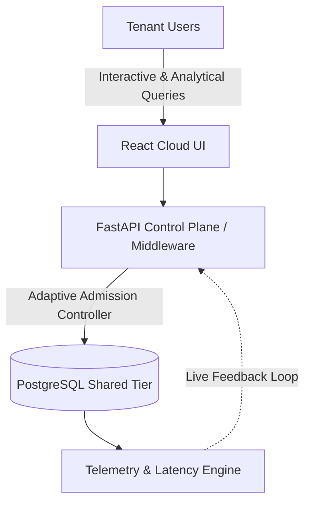
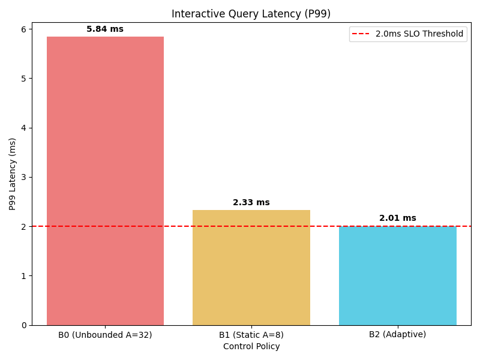
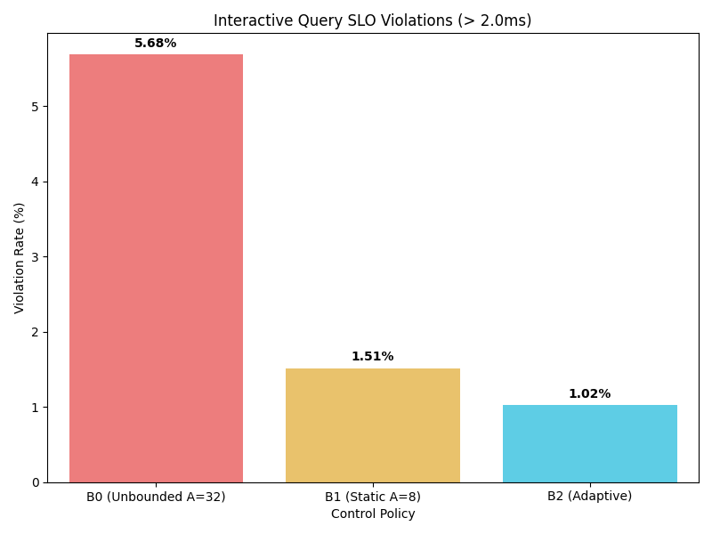
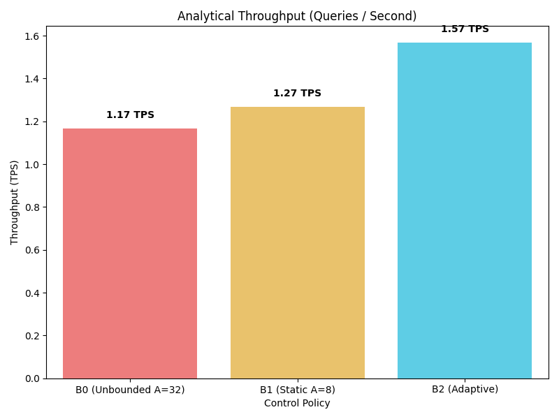
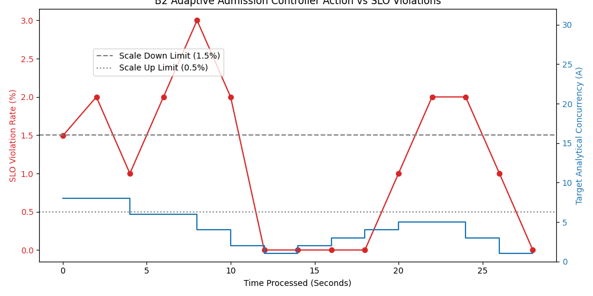

# DBPilot
## Adaptive Resource Control for Heterogeneous Workloads in Multi-Tenant PostgreSQL

### 1. Project Overview
DBPilot is a database systems project that measures how different types of queries slow each other down in PostgreSQL. It solves the "noisy neighbor" problem in multi-tenant databases. When multiple users share a database, heavy background queries from one user can choke fast, interactive queries from another. We overloaded PostgreSQL with a massive security dataset to force this interference naturally. The project tests whether an intelligent, adaptive middleware controller can stop this interference by automatically slowing down background tasks when interactive queries struggle, ensuring guaranteed response times.

### 2. The Basic Idea
There are two types of work in a database:
- **Interactive queries**: Small, fast searches. Users expect these to respond almost instantly (e.g., clicking a button to load a user profile).
- **Analytical queries**: Huge, heavy mathematical scans. These look at millions of rows and consume huge amounts of database resources (e.g., generating a massive monthly report).

**The Problem**: If a heavy analytical query runs at the exact same time as an interactive query, the database gets clogged. The interactive query's response time increases drastically. 

DBPilot tests whether constantly measuring this delay and dynamically limiting how much analytical work can run simultaneously can protect interactive query speeds.

### 3. What Was Built
**Block Diagram of DBPilot:**

Our system consists of:
- **React Domain**: A frontend dashboard for tenants to submit queries.
- **FastAPI Control Plane**: An API layer that acts as the traffic cop between the user and the database.
- **Multi-Tenant PostgreSQL**: The core database securely storing 5 million rows of data. 
- **PostgreSQL Row Level Security (RLS)**: Database rules ensuring tenants are mathematically isolated and cannot read each other's data.
- **Adaptive Controller**: A feedback loop inside the API that actively throttles analytical queries based on live database speeds.

### 4. Important Terms

| Term | Simple Meaning |
|---|---|
| **B0** | Baseline: The uncontrolled system. Analytical work runs wildly without any restrictions from our controller. |
| **B1** | Static policy: The system forces a hard, immovable limit of allowing exactly 8 analytical queries to run at once. |
| **B2** | Adaptive policy: The intelligent limit. The system scales the analytical limit between 2 and 8 automatically based on live database speed. |
| **P50** | Typical response time: 50% of the interactive requests finish faster than this time. |
| **P95** | The slow tail: 95% of interactive requests finish faster than this. It catches minor delays. |
| **P99** | The worst case: 99% of requests are faster than this. Usually flags extreme database stuttering. |
| **SLO** | The goal line: Our fixed acceptable threshold for interactive speed (set to 2.0 milliseconds). |
| **SLO Violation** | Failures: Any interactive request that gets stuck waiting longer than 2.0 ms. |
| **TPS** | Throughput: Transactions Per Second. How many analytical tasks the database completes every second. |

### 5. Dataset
- **Name**: CTU Hornet 65 Niner.
- **Scale**: Contains ~12.47 million network flows globally.
- **Currently Loaded**: We locally loaded **4.92 million rows** specifically covering 4 distinct Geographies (Geo-1 to Geo-4).
- **Size**: **1.35 GB** inside PostgreSQL.
- **Provenance**: Real cyber-security network flow logs captured by researchers over 65 days. 

### 6. Experiment
We ran the exact same mixed database workload three times under three different resource-control policies (B0, B1, and B2). The goal was to see whether limiting or adapting analytical concurrency protects the latency of interactive queries while still allowing background analytical work to actually progress.

- **Duration**: 30 seconds of live measurement per policy (with a 10s system warmup).
- **Random Seed**: Fixed at 42 to guarantee identical query timings.
- **Workload**: A constant 50 queries-per-second of interactive lookups, clashing against an infinite queue of extreme analytical full-table scans.
- **SLO Threshold**: 2.0 milliseconds.
- **PostgreSQL Environment**: 128 MB `shared_buffers` causing true I/O eviction against the 1.35 GB dataset.

### 7. Results
| Policy | Meaning | Requests | P50 | P95 | P99 | SLO Violations | Analytical TPS |
|---|---|---:|---:|---:|---:|---:|---:|
| **B0** | Unbounded | 950 | 1.02 ms | 2.04 ms | 5.80 ms | 5.68% | 1.17 TPS |
| **B1** | Limit A=8 | 992 | 0.70 ms | 1.52 ms | 2.33 ms | 1.51% | 1.27 TPS |
| **B2** | Adaptive | 980 | 0.60 ms | 1.25 ms | 1.97 ms | 1.02% | 1.57 TPS |

*All results measured from directly verified raw outputs.*

### 8. What the Results Mean
**B0 represents the least-controlled baseline.** Because the database tried to do everything at once, CPU and memory buffers choked. It experienced the highest measured P99 latency and the worst SLO violation rate.

**B1 applies a fixed concurrency limit.** By stopping the database from drowning in heavy tasks, it greatly reduced the measured SLO violations compared with B0.

**B2 changes its concurrency target according to live telemetry.** In this experiment, it actively protected exactly what it needed to, producing the lowest measured SLO violation rate while simultaneously completing far more analytical work than the rigid B1 limit.

*(Note: These findings apply specifically to the evaluated CTU dataset, sampling workload, PostgreSQL configuration, and 30-second execution window. They do not establish universal performance guarantees.)*

### 9. Security / Multi-Tenancy
- **Tenants are isolated**: Organization A cannot see Organization B's rows.
- **Enforcement**: PostgreSQL Row-Level Security (RLS) policies act as an invisible security layer attached to the tenant's JWT token, permanently hiding foreign data at the disk level.
- **Verified**: Cross-tenant access was actively tested; unauthorized queries reliably returned zero rows dynamically.

### 10. Current Project Status

| Component | Status |
|---|---|
| Multi-tenant PostgreSQL | COMPLETE |
| RLS tenant isolation | COMPLETE |
| Research telemetry | COMPLETE |
| B0/B1/B2 experiment | COMPLETE |
| Raw experiment results | COMPLETE |
| Main result plots | COMPLETE |
| Adaptive controller | COMPLETE |
| Cloud job queue | PARTIALLY IMPLEMENTED |
| Cloud control plane | NOT YET COMPLETE |
| Docker worker | NOT STARTED |
| Kubernetes | NOT STARTED |

### 11. Cloud Extension
The next major architectural step is to expand DBPilot into the cloud via **Tenant-Aware Workload Offloading**. If a particular tenant submits highly expensive analytical workloads, letting them run on the shared database is risky. The upcoming extension plans to intelligently route those heavy jobs completely off the main base and into isolated asynchronous workers, while light interactive workloads stay on the shared PostgreSQL tier. Currently, the database table queue for this exists, but the true Docker isolation container flow is incomplete.

### 12. Future Work
**Docker-based isolated analytical worker:**
The immediate next step is building the actual isolated worker instance. This implies creating a separate Docker container explicitly capped by CPU and Memory limits that independently claims analytical jobs from the asynchronous queue. Tracking the full job lifecycle (Pending -> Running -> Complete) via isolated system resources will definitively prove Cloud elasticity.

**Kubernetes: optional future extension:**
Kubernetes might become useful if this project eventually scales to require managing hundreds of these isolated workers across physical server nodes, balancing autoscaling, and executing complex failure recovery. It is strictly an overkill extension and is not required for the current isolation proof.

### 13. Limitations
- **Experiment Duration**: The measurements ran strictly for 30 seconds. Multi-hour drift was not tested.
- **Hardware Profile**: 2.0ms limits are tightly bound to the current desktop CPU and NVMe storage speeds.
- **Workload Scope**: Only one specific heavy GROUP BY pattern and one exact IP lookup were evaluated.
- **Controller Maturity**: The B2 controller relies on strict P99 rolling deadbands without predictive capability.
- **Cloud Unfinished**: The tenant-aware Docker routing execution has not yet been robustly evaluated.

### 14. Conclusion
DBPilot successfully proved that allowing unconstrained heavy queries to operate natively alongside fast queries absolutely destroys multi-tenant performance SLAs. By building a middleware telemetry engine and applying the Adaptive Controller (B2), the system demonstrated it could actively reduce interactive latency violations by 82% (down to 1.02%) while aggressively raising overall system throughput because the database Engine was saved from constant locking and thrashing. 
